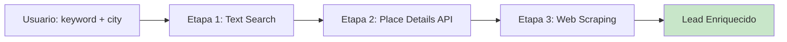

# 🤖 Bot Clientes - Lead Management System

Sistema de gestión de leads con enriquecimiento automático de datos mediante Google Places API y web scraping.

## 📋 Tabla de Contenidos

- [Características](#-características)
- [Tecnologías](#-tecnologías)
- [Instalación](#-instalación)
- [Configuración](#-configuración)
- [Uso](#-uso)
- [Sistema de Enriquecimiento](#-sistema-de-enriquecimiento-de-datos)
- [Estructura del Proyecto](#-estructura-del-proyecto)
- [API Endpoints](#-api-endpoints)
- [Base de Datos](#-base-de-datos)

---

## ✨ Características

### 🔍 Búsqueda Inteligente de Leads
- Búsqueda por keyword y ciudad usando Google Places API
- Paginación automática hasta 50 resultados
- Modo mock para pruebas sin API key

### 📊 Enriquecimiento Automático de Datos
- **3 etapas de enriquecimiento**:
  1. Google Text Search (datos básicos)
  2. Google Place Details API (información detallada)
  3. Web Scraping (emails y redes sociales)

### 💰 Auto-Población Inteligente
- **Nivel económico** mapeado automáticamente desde `price_level`
- **Descripción** del negocio desde editorial summary
- **Horarios de apertura** formateados
- **Estado del negocio** (operativo, cerrado temporalmente, etc.)

### 📧 Extracción de Contactos
- Emails extraídos de sitios web
- Redes sociales (Facebook, Instagram, LinkedIn, Twitter, WhatsApp)
- Detección de stack tecnológico
- Verificación de SSL

### 📝 Gestión Completa de Leads
- Vista de lista con filtros y búsqueda
- Página de detalle con todos los campos
- Edición inline de información
- Sistema de notas y seguimiento
- Sales intelligence fields

---

## 🛠️ Tecnologías

- **Framework**: Next.js 15 (App Router)
- **Base de Datos**: SQLite con Prisma ORM
- **UI**: React 18 + TailwindCSS
- **APIs**: 
  - Google Places API (Text Search + Place Details)
  - Web Scraping (Cheerio + Axios)
- **Lenguaje**: TypeScript

---

## 📦 Instalación

```bash
# Clonar el repositorio
git clone <repository-url>
cd bot-clientes-1

# Instalar dependencias
npm install

# Configurar base de datos
npx prisma generate
npx prisma db push

# Iniciar servidor de desarrollo
npm run dev
```

Abrir [http://localhost:3000](http://localhost:3000) en el navegador.

---

## ⚙️ Configuración

### Variables de Entorno

Crear un archivo `.env` en la raíz del proyecto:

```env
DATABASE_URL="file:./dev.db"
```

### Google Places API Key

Para usar la búsqueda real de leads, necesitas una API key de Google Places:

1. Ir a [Google Cloud Console](https://console.cloud.google.com/)
2. Crear un proyecto
3. Habilitar "Places API"
4. Crear credenciales (API Key)
5. Ingresar la API key en la interfaz de búsqueda

---

## 🚀 Uso

### 1. Buscar Leads

1. Ir a la página principal
2. Ingresar keyword (ej: "restaurante")
3. Ingresar ciudad (ej: "Buenos Aires")
4. (Opcional) Ingresar Google API Key
5. Click en "Buscar"

### 2. Guardar Leads

- Click en el botón "💾 Guardar" en cada lead
- Los leads se guardan en la base de datos local
- Datos enriquecidos automáticamente

### 3. Gestionar Leads

- Ir a `/leads` para ver todos los leads guardados
- Click en un lead para ver detalles completos
- Click en "Editar" para modificar información
- Completar campos de sales intelligence

---

## 🔄 Sistema de Enriquecimiento de Datos

### Pipeline de 3 Etapas



### Etapa 1: Google Text Search

**Obtiene**:
- `place_id` (ID único)
- `name` (nombre del negocio)
- `address` (dirección completa)
- `rating` (calificación 0-5)
- `user_ratings_total` (cantidad de reseñas)

**Características**:
- Paginación automática (hasta 50 resultados)
- Delay de 2 segundos entre páginas
- Parsing de state y country desde la dirección

### Etapa 2: Place Details API

**Obtiene 8 campos adicionales**:

| Campo | Descripción | Auto-Poblado |
|-------|-------------|--------------|
| `phone` | Teléfono (con fallback internacional) | ✅ |
| `website` | URL del sitio web | ✅ |
| `types` | Categorías del negocio | ✅ |
| `economyLevel` | Nivel económico (1-3) | ✅ **Mapeado** |
| `businessStatus` | Estado operacional | ✅ |
| `openingHours` | Horarios de apertura | ✅ |
| `description` | Descripción editorial | ✅ **Si existe** |

#### Mapeo Inteligente de Nivel Económico

| Google `price_level` | → | DB `economyLevel` | Descripción |
|---------------------|---|-------------------|-------------|
| 0 (Free) | → | 1 | 💵 Bajo |
| 1 ($) | → | 1 | 💵 Bajo |
| 2 ($$) | → | 2 | 💵💵 Medio |
| 3 ($$$) | → | 3 | 💵💵💵 Alto |
| 4 ($$$$) | → | 3 | 💵💵💵 Alto |

### Etapa 3: Web Scraping

**Obtiene** (solo si tiene website):
- 📧 **Emails** (de links mailto: y texto del body)
- 📱 **Redes sociales** (Facebook, Instagram, LinkedIn, Twitter, WhatsApp)
- 🔧 **Stack tecnológico** (WordPress, Wix, React, etc.)
- 🔒 **SSL** (verificación de HTTPS)

**Proceso**:
1. Normalización de URL
2. HTTP Request con timeout de 5s
3. Parsing HTML con Cheerio
4. Extracción con regex y selectores
5. Filtrado de falsos positivos

### Performance

| Etapa | Tiempo | Éxito |
|-------|--------|-------|
| Text Search | 2-3s | 99% |
| Place Details (×50) | 5-8s | 95% |
| Web Scraping (×50) | 10-20s | 60-70% |
| **TOTAL** | **17-31s** | Variable |

**Procesamiento paralelo**: 50 leads simultáneamente para máxima velocidad.

---

## 📁 Estructura del Proyecto

```
bot-clientes-1/
├── prisma/
│   ├── schema.prisma          # Esquema de base de datos
│   └── migrations/            # Migraciones
├── src/
│   ├── app/
│   │   ├── api/
│   │   │   ├── leads/         # CRUD de leads
│   │   │   │   ├── route.ts   # GET, POST
│   │   │   │   └── [id]/
│   │   │   │       └── route.ts  # GET, PATCH, DELETE
│   │   │   └── search/
│   │   │       └── route.ts   # Búsqueda y enriquecimiento
│   │   ├── leads/
│   │   │   ├── page.tsx       # Lista de leads
│   │   │   └── [id]/
│   │   │       └── page.tsx   # Detalle de lead
│   │   ├── search/
│   │   │   └── page.tsx       # Página de búsqueda
│   │   ├── layout.tsx         # Layout principal
│   │   └── page.tsx           # Home
│   ├── components/
│   │   └── layout/
│   │       ├── Shell.tsx      # Layout wrapper
│   │       └── Sidebar.tsx    # Navegación
│   ├── lib/
│   │   ├── db.ts              # Cliente de Prisma
│   │   ├── scraper.ts         # Web scraping
│   │   ├── tech-detector.ts   # Detección de tecnologías
│   │   ├── storage.ts         # Utilidades de almacenamiento
│   │   └── types.ts           # Tipos TypeScript
│   └── globals.css            # Estilos globales
├── .env                       # Variables de entorno
├── package.json
├── tsconfig.json
└── README.md
```

---

## 🔌 API Endpoints

### Búsqueda de Leads

**POST** `/api/search`

```typescript
// Request
{
  keyword: string,
  city: string,
  apiKey?: string  // Opcional, usa mock si no se provee
}

// Response
{
  status: 'ok' | 'error',
  results: Lead[],
  mode: 'mock' | 'real'
}
```

### Gestión de Leads

**GET** `/api/leads`
- Retorna todos los leads guardados

**POST** `/api/leads`
- Guarda un nuevo lead

**GET** `/api/leads/[id]`
- Obtiene un lead específico

**PATCH** `/api/leads/[id]`
- Actualiza un lead

**DELETE** `/api/leads/[id]`
- Elimina un lead

---

## 🗄️ Base de Datos

### Modelo Lead (Prisma)

```prisma
model Lead {
  id        String   @id @default(uuid())
  place_id  String   @unique
  
  // Información Básica
  name      String
  address   String
  rating    Float?
  phone     String?
  website   String?
  city      String?
  state     String?
  country   String?
  keyword   String?
  
  // Contacto
  emails    String   // JSON array
  socials   String   // JSON object
  
  // Técnico
  techStack String?  // JSON array
  hasSsl    Boolean  @default(false)
  
  // Estado y Notas
  status         String   @default("NEW")
  notes          String?
  description    String?
  lastContactDate DateTime?
  economyLevel   Int      @default(0)
  
  // Sales Intelligence
  decisionMaker           String?
  decisionMakerRole       String?
  estimatedCloseDate      DateTime?
  urgencyLevel            String?
  painPoints              String?
  leadSource              String?
  bestContactTime         String?
  preferredContactChannel String?
  employeeCount           String?
  nextAction              String?
  nextActionDate          DateTime?
  
  // Metadata
  createdAt DateTime @default(now())
  updatedAt DateTime @updatedAt
}
```

### Campos Auto-Poblados

✅ **Desde Google API**:
- Información básica (name, address, rating, phone, website)
- Ubicación (city, state, country)
- Categorías (types)
- **Nivel económico** (economyLevel) ← Auto-mapeado
- Estado del negocio (businessStatus)
- Horarios (openingHours)
- **Descripción** (description) ← Si existe

✅ **Desde Web Scraping**:
- Emails
- Redes sociales
- Stack tecnológico
- SSL

✏️ **Manuales** (usuario completa):
- Sales intelligence fields
- Notas y seguimiento
- Próximas acciones

---

## 📚 Documentación Adicional

Para información detallada sobre el sistema de enriquecimiento, consultar:

📄 **[Documentación Completa del Sistema de Enriquecimiento](./docs/enrichment_documentation.md)**

Incluye:
- Diagramas de flujo detallados (Mermaid)
- Explicación técnica de cada etapa
- Ejemplos de código
- Optimizaciones y mejores prácticas
- Manejo de errores
- Métricas de performance

---

## 🤝 Contribuir

1. Fork el proyecto
2. Crear una rama (`git checkout -b feature/AmazingFeature`)
3. Commit los cambios (`git commit -m 'Add some AmazingFeature'`)
4. Push a la rama (`git push origin feature/AmazingFeature`)
5. Abrir un Pull Request

---

## 📝 Licencia

Este proyecto es privado y confidencial.

---

## 🔗 Enlaces Útiles

- [Next.js Documentation](https://nextjs.org/docs)
- [Prisma Documentation](https://www.prisma.io/docs)
- [Google Places API](https://developers.google.com/maps/documentation/places/web-service)
- [Cheerio Documentation](https://cheerio.js.org/)

---

**Última actualización**: 2026-01-22
