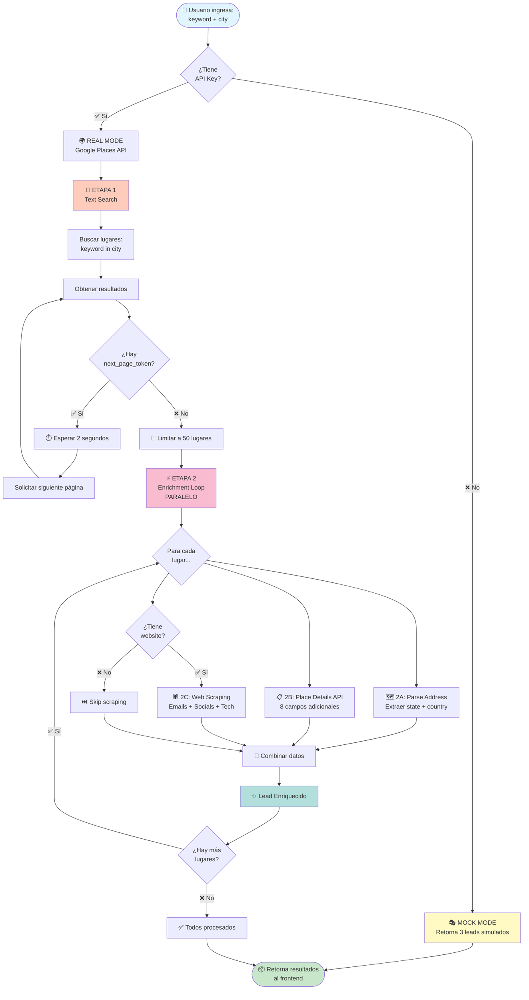
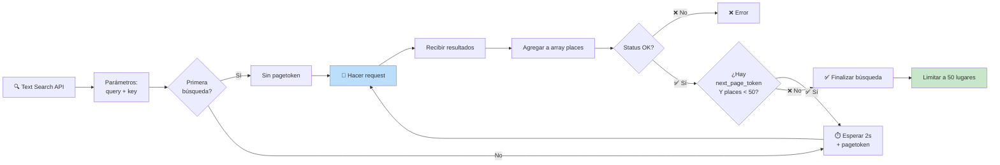
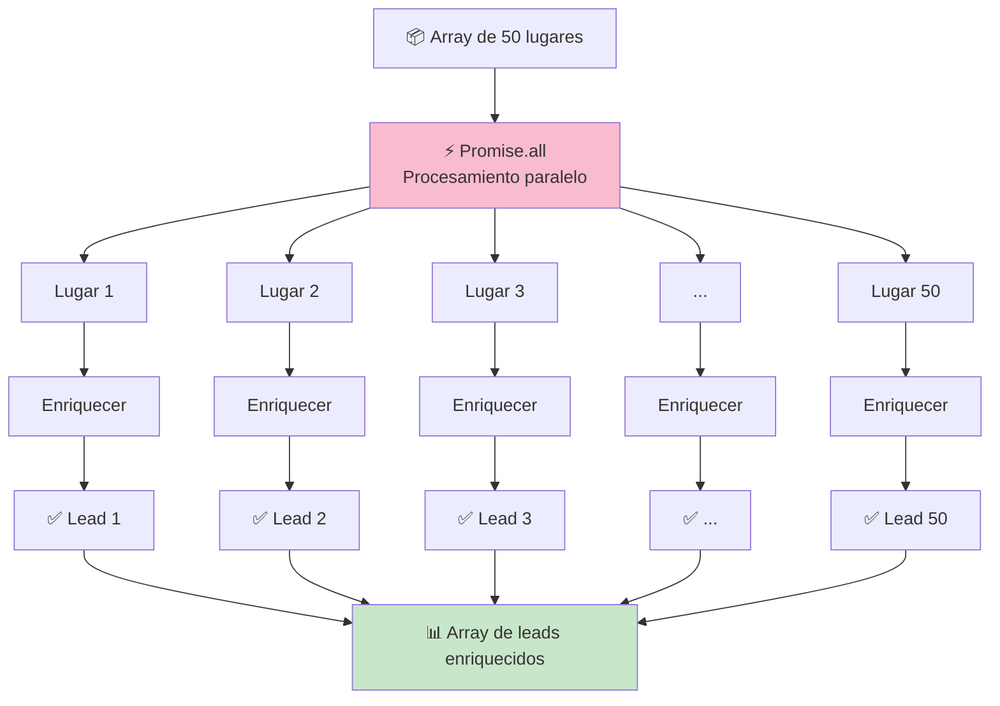
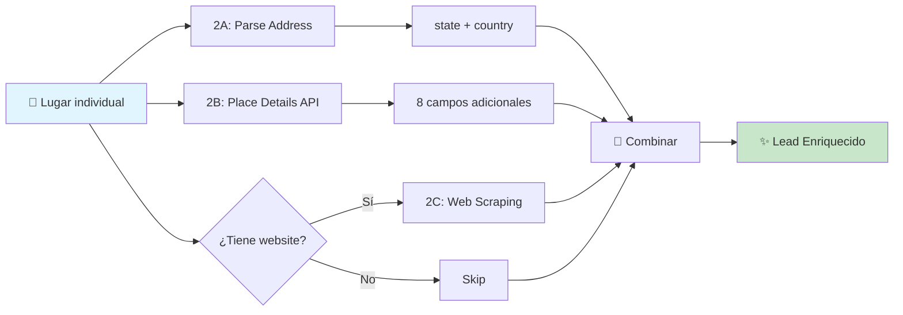
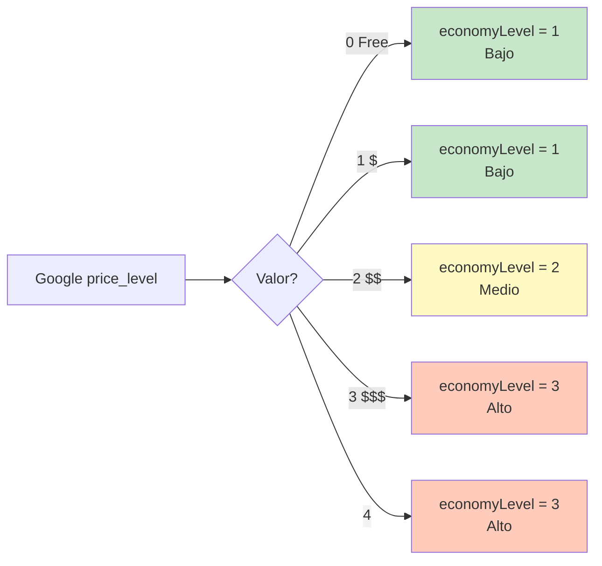
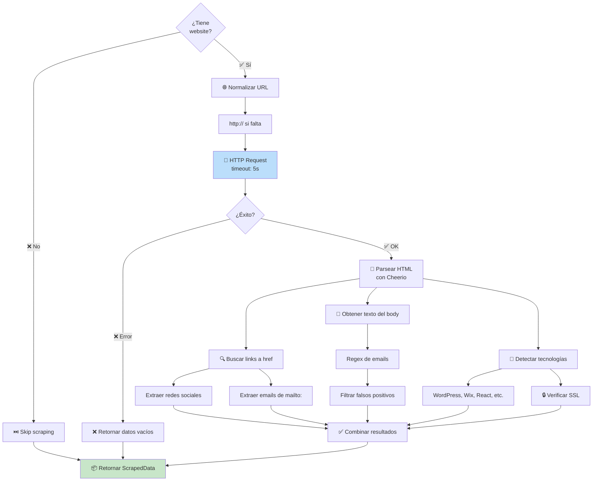
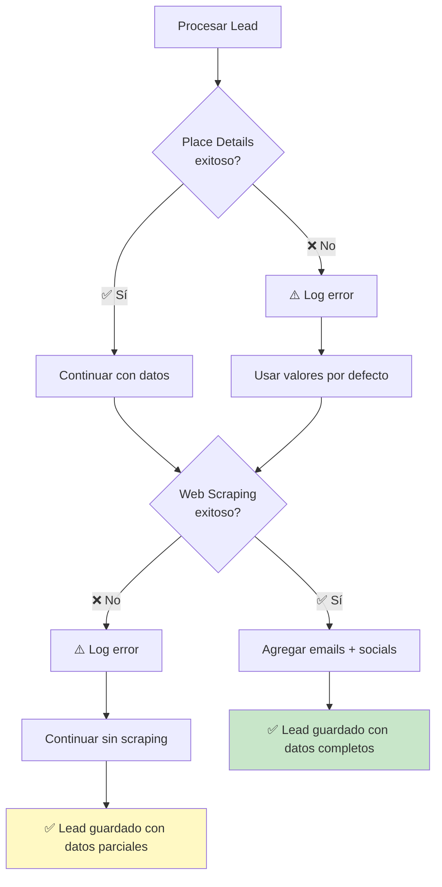

# 🔄 Sistema de Enriquecimiento de Datos - Documentación Completa

## 📋 Índice
1. [Resumen Ejecutivo](#resumen-ejecutivo)
2. [Diagrama de Flujo Principal](#diagrama-de-flujo-principal)
3. [Etapa 1: Búsqueda Inicial](#etapa-1-búsqueda-inicial)
4. [Etapa 2: Enriquecimiento Paralelo](#etapa-2-enriquecimiento-paralelo)
5. [Etapa 3: Web Scraping](#etapa-3-web-scraping)
6. [Estructura de Datos](#estructura-de-datos)
7. [Performance y Optimización](#performance-y-optimización)
8. [Manejo de Errores](#manejo-de-errores)

---

## 📋 Resumen Ejecutivo

El sistema utiliza un **pipeline de enriquecimiento en 3 etapas** para obtener la máxima información posible sobre cada lead:

1. **🔍 Búsqueda Inicial** → Google Places Text Search (datos básicos)
2. **🎯 Enriquecimiento API** → Google Place Details (información detallada)
3. **🌐 Web Scraping** → Extracción de emails y redes sociales

**Resultado**: Leads con ~25 campos poblados automáticamente, listos para contacto inmediato.

---

## 🗺️ Diagrama de Flujo Principal



---

## 📍 Etapa 1: Búsqueda Inicial (Text Search)

### Diagrama de Flujo Detallado



### Datos Obtenidos

| Campo | Tipo | Ejemplo | Descripción |
|-------|------|---------|-------------|
| `place_id` | string | `ChIJN1t_tDeuEmsR...` | ID único en Google |
| `name` | string | `"Restaurante La Esquina"` | Nombre del negocio |
| `formatted_address` | string | `"Av. Corrientes 1234..."` | Dirección completa |
| `rating` | number | `4.5` | Calificación (0-5) |
| `user_ratings_total` | number | `234` | Cantidad de reseñas |

### Código Clave

```typescript
let places = [];
let nextPageToken = undefined;

do {
    const params = { query, key: apiKey };
    if (nextPageToken) {
        params.pagetoken = nextPageToken;
        await new Promise(resolve => setTimeout(resolve, 2000)); // ⏱️ Delay obligatorio
    }
    
    const textSearchRes = await client.textSearch({ params, timeout: 10000 });
    
    if (textSearchRes.data.status !== 'OK' && textSearchRes.data.status !== 'ZERO_RESULTS') {
        throw new Error(`Google API Error: ${textSearchRes.data.status}`);
    }
    
    places = [...places, ...textSearchRes.data.results];
    nextPageToken = textSearchRes.data.next_page_token;
    
} while (nextPageToken && places.length < 50);

const limitedPlaces = places.slice(0, 50); // 🔢 Hard limit
```

---

## 🎯 Etapa 2: Enriquecimiento Paralelo

### Diagrama de Procesamiento Paralelo



### Sub-Etapas del Enriquecimiento



---

### 2A. Parse de Dirección

**Función**: Extraer `state` y `country` de la dirección formateada

```typescript
function parseAddress(address: string): { state: string | null; country: string | null } {
    if (!address) return { state: null, country: null };
    
    // Formato: "Calle 123, Ciudad, Provincia, País"
    const parts = address.split(',').map(p => p.trim());
    
    const country = parts[parts.length - 1];      // 🌍 Última parte
    const state = parts.length >= 3 ? parts[parts.length - 2] : null; // 📍 Penúltima
    
    return { state, country };
}
```

**Ejemplo**:
```
Input:  "Av. Pellegrini 1295, S2000BTM Rosario, Santa Fe, Argentina"
Output: { state: "Santa Fe", country: "Argentina" }
```

---

### 2B. Place Details API

**Endpoint**: `client.placeDetails()`

**Fields Solicitados** (8 campos):

```typescript
fields: [
    'formatted_phone_number',      // 📞 Teléfono local
    'international_phone_number',  // 📞 Teléfono internacional
    'website',                     // 🌐 URL del sitio
    'type',                        // 🏷️ Categorías
    'price_level',                 // 💰 Nivel de precio (0-4)
    'business_status',             // 🏢 Estado operacional
    'opening_hours',               // 🕐 Horarios
    'editorial_summary'            // 📝 Descripción
]
```

#### Procesamiento de Campos

##### 📞 Teléfono (con fallback)
```typescript
finalPlace.phone = result.formatted_phone_number 
                || result.international_phone_number 
                || '';
```

##### 🏷️ Categorías del Negocio
```typescript
if (result.types) {
    finalPlace.types = result.types as string[];
}
```

**Ejemplo**: `['restaurant', 'food', 'point_of_interest', 'establishment']`

##### 💰 Nivel Económico - Mapeo Inteligente



**Código**:
```typescript
if (result.price_level !== undefined && result.price_level !== null) {
    const priceLevel = result.price_level as number;
    
    if (priceLevel === 0) {
        finalPlace.economyLevel = 1;  // Gratis → Bajo
    } else if (priceLevel >= 1 && priceLevel <= 2) {
        finalPlace.economyLevel = priceLevel;  // 1→1, 2→2
    } else if (priceLevel >= 3) {
        finalPlace.economyLevel = 3;  // 3 o 4 → Alto
    }
}
```

**Tabla de Mapeo**:

| Google `price_level` | Significado | DB `economyLevel` | Descripción UI |
|---------------------|-------------|-------------------|----------------|
| 0 | Free | 1 | 💵 Bajo costo |
| 1 | $ | 1 | 💵 Bajo |
| 2 | $$ | 2 | 💵💵 Medio |
| 3 | $$$ | 3 | 💵💵💵 Alto |
| 4 | $$$$ | 3 | 💵💵💵 Alto |

##### 🏢 Estado del Negocio
```typescript
businessStatus = result.business_status;
```

**Valores posibles**:
- `OPERATIONAL` ✅ - Operativo
- `CLOSED_TEMPORARILY` ⏸️ - Cerrado temporalmente
- `CLOSED_PERMANENTLY` ❌ - Cerrado permanentemente

##### 🕐 Horarios de Apertura
```typescript
if (result.opening_hours?.weekday_text) {
    openingHours = result.opening_hours.weekday_text.join('\n');
}
```

**Ejemplo de Output**:
```
Lunes: 9:00–18:00
Martes: 9:00–18:00
Miércoles: 9:00–18:00
Jueves: 9:00–18:00
Viernes: 9:00–18:00
Sábado: 10:00–14:00
Domingo: Cerrado
```

##### 📝 Descripción Editorial
```typescript
if (result.editorial_summary?.overview) {
    description = result.editorial_summary.overview;
}
```

**Ejemplo**: 
> "Un restaurante familiar con más de 20 años de tradición en la zona, especializado en cocina argentina."

---

## 🕷️ Etapa 3: Web Scraping

### Diagrama de Flujo del Scraping



### Proceso Detallado

#### 1️⃣ Normalización de URL
```typescript
function normalizeUrl(url: string): string {
    if (!url.startsWith('http')) {
        return `http://${url}`;
    }
    return url;
}
```

**Ejemplos**:
- `"example.com"` → `"http://example.com"`
- `"https://example.com"` → `"https://example.com"` (sin cambios)

#### 2️⃣ Request HTTP
```typescript
const response = await axios.get(targetUrl, {
    timeout: 5000,  // ⏱️ 5 segundos máximo
    headers: {
        'User-Agent': 'Mozilla/5.0 (Windows NT 10.0; Win64; x64) AppleWebKit/537.36'
    }
});

const html = response.data;
const $ = cheerio.load(html);  // 📄 Parser HTML
```

#### 3️⃣ Extracción de Redes Sociales

```typescript
const socials = {};

$('a[href]').each((_, el) => {
    const href = $(el).attr('href').toLowerCase();
    
    // Facebook
    if (href.includes('facebook.com') && !socials.facebook) {
        socials.facebook = href;
    }
    
    // Instagram
    if (href.includes('instagram.com') && !socials.instagram) {
        socials.instagram = href;
    }
    
    // LinkedIn
    if (href.includes('linkedin.com') && !socials.linkedin) {
        socials.linkedin = href;
    }
    
    // Twitter/X
    if ((href.includes('twitter.com') || href.includes('x.com')) && !socials.twitter) {
        socials.twitter = href;
    }
    
    // WhatsApp (procesamiento especial)
    if (href.includes('wa.me') || href.includes('api.whatsapp.com')) {
        const match = href.match(/(?:wa\.me\/|phone=)(\d+)/);
        if (match) {
            socials.whatsapp_link = `https://web.whatsapp.com/send?phone=${match[1]}`;
        }
    }
});
```

**Ejemplo de Output**:
```javascript
{
    facebook: 'https://facebook.com/restaurantelaesquina',
    instagram: 'https://instagram.com/laesquina',
    whatsapp_link: 'https://web.whatsapp.com/send?phone=5491145678900'
}
```

#### 4️⃣ Extracción de Emails

##### De links `mailto:`
```typescript
$('a[href]').each((_, el) => {
    const href = $(el).attr('href').toLowerCase();
    
    if (href.startsWith('mailto:')) {
        const email = href.replace('mailto:', '').split('?')[0];
        if (email && email.includes('@')) {
            emails.add(email);
        }
    }
});
```

##### Del texto del body (Regex)
```typescript
const bodyText = $('body').text();
const emailRegex = /[a-zA-Z0-9._%+-]+@[a-zA-Z0-9.-]+\.[a-zA-Z]{2,}/g;
const foundEmails = bodyText.match(emailRegex) || [];

foundEmails.forEach(email => {
    // 🚫 Filtrar falsos positivos (archivos de imagen, CSS, etc.)
    if (!email.match(/\.(png|jpg|jpeg|gif|css|js|woff|ttf)$/i)) {
        emails.add(email);
    }
});
```

**Ejemplo de Output**:
```javascript
['info@laesquina.com.ar', 'reservas@laesquina.com.ar', 'contacto@laesquina.com.ar']
```

#### 5️⃣ Detección de Tecnología

```typescript
const { tech_stack, has_ssl } = detectTechAndSeo(html, targetUrl);
```

**Tecnologías Detectadas**:
- **CMS**: WordPress, Wix, Shopify, Squarespace
- **Frameworks**: React, Vue, Angular, Next.js
- **Analytics**: Google Analytics, Facebook Pixel, Hotjar
- **Otros**: jQuery, Bootstrap, Tailwind CSS

**SSL Detection**:
```typescript
const has_ssl = targetUrl.startsWith('https://');
```

### Output Final del Scraping

```typescript
{
    emails: ['info@ejemplo.com', 'ventas@ejemplo.com'],
    socials: {
        facebook: 'https://facebook.com/ejemplo',
        instagram: 'https://instagram.com/ejemplo',
        linkedin: 'https://linkedin.com/company/ejemplo',
        whatsapp_link: 'https://web.whatsapp.com/send?phone=5491145678900'
    },
    tech_stack: ['WordPress', 'Google Analytics', 'jQuery'],
    has_ssl: true,
    website_status: 'Success'
}
```

---

## 📦 Estructura de Datos Final

### Lead Enriquecido Completo

```typescript
{
    // ═══════════════════════════════════════
    // DATOS BÁSICOS (Text Search)
    // ═══════════════════════════════════════
    place_id: 'ChIJN1t_tDeuEmsRUsoyG83frY4',
    name: 'Restaurante La Esquina',
    address: 'Av. Corrientes 1234, Buenos Aires, Argentina',
    rating: 4.5,
    user_ratings_total: 234,
    
    // ═══════════════════════════════════════
    // CONTEXTO AGREGADO (Parseado)
    // ═══════════════════════════════════════
    city: 'Buenos Aires',
    state: 'Buenos Aires',
    country: 'Argentina',
    keyword: 'restaurante',
    
    // ═══════════════════════════════════════
    // PLACE DETAILS API (8 campos nuevos)
    // ═══════════════════════════════════════
    phone: '+54 11 4567-8900',
    website: 'https://laesquina.com.ar',
    types: ['restaurant', 'food', 'point_of_interest'],
    economyLevel: 2,              // ← 💰 AUTO-MAPEADO
    businessStatus: 'OPERATIONAL',
    openingHours: 'Lunes: 12:00–23:00\nMartes: 12:00–23:00...',
    description: 'Restaurante tradicional argentino...',  // ← 📝 AUTO
    
    // ═══════════════════════════════════════
    // WEB SCRAPING (Condicional)
    // ═══════════════════════════════════════
    emails: ['info@laesquina.com.ar', 'reservas@laesquina.com.ar'],
    socials: {
        facebook: 'https://facebook.com/laesquina',
        instagram: 'https://instagram.com/laesquina',
        whatsapp_link: 'https://web.whatsapp.com/send?phone=5491145678900'
    },
    techStack: ['WordPress', 'Google Analytics'],
    hasSsl: true
}
```

---

## ⚡ Performance y Optimización

### Métricas de Tiempo

```mermaid
gantt
    title Timeline de Enriquecimiento (50 leads)
    dateFormat X
    axisFormat %Ss
    
    section Etapa 1
    Text Search (paginación)    :0, 3s
    
    section Etapa 2
    Place Details API (paralelo) :3s, 8s
    
    section Etapa 3
    Web Scraping (paralelo)      :8s, 20s
    
    section Total
    Proceso completo             :0, 28s
```

| Etapa | Tiempo Promedio | Tasa de Éxito | Notas |
|-------|----------------|---------------|-------|
| **Text Search** | 2-3s | 99% | Incluye paginación |
| **Place Details (×50)** | 5-8s | 95% | Procesamiento paralelo |
| **Web Scraping (×50)** | 10-20s | 60-70% | Depende de disponibilidad web |
| **TOTAL** | **17-31s** | Variable | Para 50 leads |

### Paralelización

```typescript
// ⚡ Procesamiento paralelo de 50 lugares
const enrichedResults = await Promise.all(
    limitedPlaces.map(async (place) => {
        // Cada lugar se procesa independientemente
        return await enrichPlace(place);
    })
);
```

**Ventajas**:
- ✅ **Velocidad**: 50 leads en ~20s vs ~5 minutos secuencial
- ✅ **Eficiencia**: Aprovecha I/O asíncrono de Node.js
- ✅ **Escalabilidad**: Fácil de ajustar el límite

**Desventajas**:
- ⚠️ **Rate Limits**: Puede exceder límites de Google API
- ⚠️ **Memoria**: 50 requests simultáneos consumen más RAM
- ⚠️ **Errores**: Un error no detiene todo el proceso

### Optimizaciones Posibles

#### 1. Rate Limiting por Chunks
```typescript
// Procesar en grupos de 10
const chunks = chunkArray(limitedPlaces, 10);

for (const chunk of chunks) {
    await Promise.all(chunk.map(enrichPlace));
    await delay(1000); // Pausa entre chunks
}
```

#### 2. Caché de Place Details
```typescript
// Guardar en Redis para evitar re-fetch
const cacheKey = `place:${place_id}`;
const cached = await redis.get(cacheKey);

if (cached) {
    return JSON.parse(cached);
}

const details = await fetchPlaceDetails(place_id);
await redis.set(cacheKey, JSON.stringify(details), 'EX', 86400); // 24h
```

#### 3. Scraping Selectivo
```typescript
// Solo scrapear si no hay emails en DB
const existingLead = await prisma.lead.findUnique({ where: { place_id } });

if (existingLead && existingLead.emails.length > 0) {
    console.log('Emails already exist, skipping scraping');
    return existingLead.emails;
}
```

---

## 🛡️ Manejo de Errores

### Estrategia Fail-Safe



### Código de Manejo de Errores

```typescript
// Place Details API
try {
    const detailsRes = await client.placeDetails({...});
    if (detailsRes.data.result) {
        // Procesar datos
    }
} catch (e) {
    console.error(`Error fetching details for ${place.place_id}`, e);
    // ✅ Continúa con valores por defecto
}

// Web Scraping
if (finalPlace.website) {
    try {
        const scrapeData = await scrapeWebsite(finalPlace.website);
        finalPlace.emails = scrapeData.emails;
        finalPlace.socials = scrapeData.socials;
    } catch (scrapeError) {
        console.error(`Scraping failed for ${finalPlace.website}`, scrapeError);
        // ✅ Continúa sin datos de scraping
    }
}
```

**Principios**:
1. ✅ **Nunca fallar todo el proceso** por un lead
2. ✅ **Guardar datos parciales** es mejor que nada
3. ✅ **Logging detallado** para debugging
4. ✅ **Timeouts** para evitar bloqueos infinitos

---

## 📊 Campos Auto-Poblados vs Manuales

### ✅ Auto-Poblados desde Google API

| Campo | Fuente | Confiabilidad |
|-------|--------|---------------|
| `place_id` | Text Search | 100% |
| `name` | Text Search | 100% |
| `address` | Text Search | 100% |
| `rating` | Text Search | 95% |
| `phone` | Place Details | 80% |
| `website` | Place Details | 70% |
| `city` | Parseado | 100% |
| `state` | Parseado | 95% |
| `country` | Parseado | 100% |
| `types` | Place Details | 90% |
| **`economyLevel`** | **Place Details (mapeado)** | **60%** |
| `businessStatus` | Place Details | 85% |
| `openingHours` | Place Details | 75% |
| **`description`** | **Place Details** | **40%** |

### 🌐 Auto-Poblados desde Web Scraping

| Campo | Confiabilidad | Notas |
|-------|---------------|-------|
| `emails[]` | 60-70% | Depende de la web |
| `socials.facebook` | 70% | Común en sitios |
| `socials.instagram` | 65% | Muy común |
| `socials.linkedin` | 40% | Menos común |
| `socials.whatsapp_link` | 50% | Variable |
| `techStack[]` | 80% | Fácil de detectar |
| `hasSsl` | 100% | Verificación simple |

### ✏️ Campos Manuales (Usuario debe completar)

**Sales Intelligence**:
- `status` (NEW → CONTACTED → INTERESTED → CLIENT)
- `notes`
- `lastContactDate`
- `decisionMaker`, `decisionMakerRole`
- `estimatedCloseDate`, `urgencyLevel`
- `painPoints`
- `leadSource`
- `bestContactTime`, `preferredContactChannel`
- `employeeCount`
- `nextAction`, `nextActionDate`

---

## 🔒 Consideraciones de Seguridad

### 1. User-Agent Spoofing
```typescript
headers: {
    'User-Agent': 'Mozilla/5.0 (Windows NT 10.0; Win64; x64)...'
}
```
**Razón**: Muchos sitios bloquean requests sin User-Agent válido

### 2. Timeouts
```typescript
timeout: 5000  // 5 segundos máximo
```
**Razón**: Previene scraping infinito en sitios lentos

### 3. Validación de Emails
```typescript
// Filtrar archivos que parecen emails
if (!email.match(/\.(png|jpg|jpeg|gif|css|js|woff|ttf)$/i)) {
    emails.add(email);
}
```
**Razón**: Evita falsos positivos como `image@2x.png`

### 4. Error Handling
```typescript
try {
    // Operación riesgosa
} catch (error) {
    console.error('Error:', error);
    // Continuar con valores por defecto
}
```
**Razón**: Un error no debe detener todo el proceso

---

## 🎓 Conclusión

### Resumen del Sistema

El pipeline de enriquecimiento implementa un **sistema robusto y eficiente** que:

✅ **Maximiza la información** obtenida de cada lead  
✅ **Combina 3 fuentes** de datos complementarias  
✅ **Procesa en paralelo** para velocidad óptima  
✅ **Maneja errores gracefully** sin perder datos  
✅ **Auto-popula campos inteligentemente** (economyLevel, description)  
✅ **Proporciona datos de alta calidad** listos para uso inmediato  

### Resultado Final

**Leads altamente enriquecidos** con:
- 📊 ~25 campos poblados automáticamente
- 📧 Emails y redes sociales extraídos
- 💰 Nivel económico mapeado inteligentemente
- 🕐 Horarios y estado del negocio
- 🔧 Stack tecnológico detectado

**Listos para contacto inmediato y seguimiento efectivo.**

---

## 📚 Referencias

- [Google Places API - Text Search](https://developers.google.com/maps/documentation/places/web-service/search-text)
- [Google Places API - Place Details](https://developers.google.com/maps/documentation/places/web-service/place-details)
- [Cheerio Documentation](https://cheerio.js.org/)
- [Axios Documentation](https://axios-http.com/)

---

**Última actualización**: 2026-01-22  
**Versión**: 1.0  
**Autor**: Sistema de Enriquecimiento de Leads
